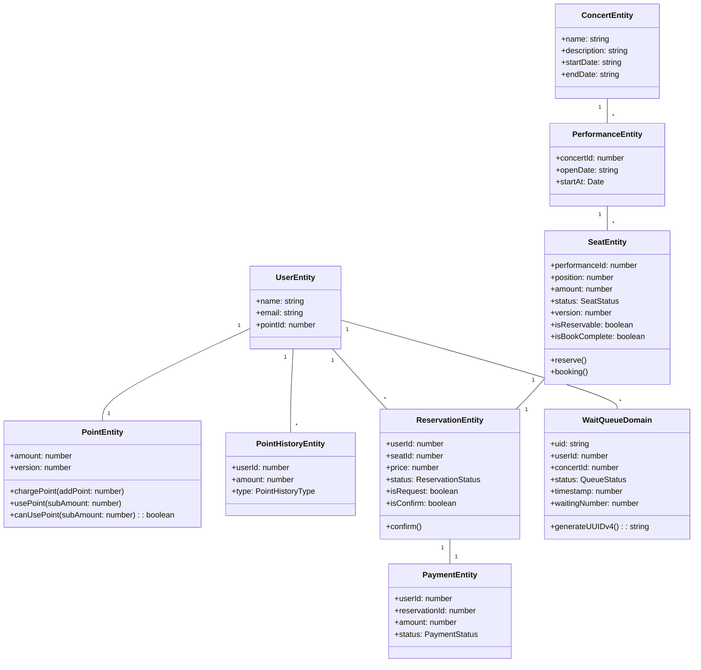

# 콘서트 예약 서비스

## 1. 설계 및 참고 문서

### 1.1. 설계 문서
- [마일 스톤](https://github.com/users/dbwogus94/projects/3)
- [요구사항](docs/1-요구사항.md)
- [시퀀스 다이어그램](docs/2-시퀀스다이어그램.md)
- [API 정의서](docs/3-API-정의서.md)
- [ERD 설계서](docs/4-ERD-정의서.md)
- [Swagger 이미지](docs/image/swagger.png)
- [동시성에 대한 분석]()
- [PR로 보는 문제 해결 과정](https://github.com/dbwogus94/hhplus-concert-ticketing-service/pulls?q=is%3Apr+is%3Aclosed+label%3A%22%EC%9D%BD%EA%B8%B0%2F%EC%93%B0%EA%B8%B0+%EC%84%B1%EB%8A%A5+%EA%B0%9C%EC%84%A0%22%2C%22%EC%8B%9C%EB%82%98%EB%A6%AC%EC%98%A4+%EC%84%9C%EB%B2%84+%EA%B5%AC%EC%B6%95%22+sort%3Acreated-asc)

### 1.2. 과제를 해결하며 작성한 보고서
- [콘서트 서비스 인덱스 활용 보고서](https://www.notion.so/jaehyun0119/STEP-15-13e8dbc2842280d3a48ee0dbe6430988)
- [레디스를 사용한 캐시 전략 분석 보고서](docs/STEP13-Redis-사용보고서.md)
- [트랜잭션 처리의 한계와 해결방안 서비스 설계 보고서](https://www.notion.so/jaehyun0119/STEP-16-13e8dbc28422807b87e0d367eccf0a36)
- [시나리오 테스트 보고서](https://www.notion.so/jaehyun0119/STEP-19-14c8dbc2842280fa851fd02d9a8ca836)
- [가상 장애 대응 보고서](https://www.notion.so/jaehyun0119/STEP-20-14c8dbc2842280f5840ac7af706797b7)

## 2. 서버 환경
- Programming Language: `Typescript ^5.0.0`
- Runtime: `Node.js ^20.15.0`
- Framework: `Nestjs ^10.0.0`
- ORM: `Typeorm ^0.3.x`
- DataBase: `Mysql 8`
- Test: `Jest ^29.5.0`

## 3. 소스코드 폴더 구조

### 3.1. src 폴더 구조
```bash
src/
├── app.module.ts           # Nestjs 루트 모듈
├── main.ts                 # 애플리케이션 진입점
├── common/                 # 공통 유틸리티
│   ├── database/             # DB 설정 및 기본 엔티티
│   ├── exception/            # 예외 처리
│   ├── interceptor/          # 인터셉터
│   ├── middleware/           # 미들웨어
│   └── decorator/            # 커스텀 데코레이터
├── global/                 # 전역 설정
│   ├── aop/                  # AOP 모듈
│   ├── logger/               # 로깅 설정
│   ├── redis/                # Redis 설정
│   └── event-emitter/        # 이벤트 에미터
└── domain/                 # 도메인별 비즈니스 로직
    ├── user/                 # 사용자 도메인
    │   ├── presentation/       # REST API Controller
    │   ├── application/        # Facade (Use Case 조합)
    │   ├── domain/             # 비즈니스 로직 Service
    │   └── infra/              # Repository 구현체
    ├── concert/              # 콘서트 도메인
    │   └── performance/        # 공연 서브도메인
    ├── reservation/          # 예약 도메인
    ├── payment/              # 결제 도메인
    ├── queue/                # 대기열 도메인
    └── batch/                # 배치 작업
        ├── presentation/       # Cron Scheduler
        └── application/        # 배치 로직 조합
```

### 3.2. 도메인별 레이어 구조
각 도메인은 Clean Architecture 패턴을 참고해서 4개 계층으로 구성됩니다.
```bash
domain/{domain-name}/
├── presentation/               # 표현 계층
│   ├── {domain}.controller.ts
│   ├── {domain}.consumer.ts      # Kafka Consumer (선택적)
│   └── dto/                      # Request/Response DTO
├── application/                  # 응용 계층
│   └── {domain}.facade.ts        # Use Case 조합
├── domain/                       # 도메인 계층
│   ├── {domain}.service.ts
│   ├── model/
│   │   ├── {entity}.entity.ts  # 도메인 객체
│   │   └── enum/
│   └── dto/                      # Domain DTO
└── infra/                      # 인프라 계층
    ├── {domain}.repository.ts      # Interface
    ├── {domain}-core.repository.ts # Implementation
    └── {domain}-producer.ts        # Kafka Producer (선택적)
```

### 3.3. 테스트 폴더 구조
```bash
test/
├── user/
├── concert/
├── reservation/
├── payment/
├── queue/
├── fixture/               # 테스트 픽스처
├── common/               # 공통 테스트 유틸
└── test-container/       # 테스트 컨테이너 설정
```

## 4. 아키텍처

### 4.1. 전체 아키텍처
Clean Architecture를 참고한 방향으로 **레이어드 아키텍처**를 채택하였습니다.

#### Presentation(interface) 계층
- **REST API Controller**: 클라이언트 요청 처리 및 응답
- **Cron Scheduler**: 배치 작업 스케줄링 (batch 도메인)
- **Kafka Consumer**: 이벤트 소비 및 처리
- **Guard**: JWT 토큰 검증 및 대기열 상태 확인
- **Interceptor**: 응답 포매팅 및 예외 처리

#### Application 계층  
- **Facade**: 여러 도메인 Service를 조합하여 Use Case 구현
- **DTO**: criteria 네이밍으로 데이터 전송 객체 관리
- **Transaction Management**: 트랜잭션 경계 설정

#### Domain 계층
- **Service**: 핵심 비즈니스 로직 처리
- **Entity**: 도메인 객체 및 비즈니스 규칙
- **Domain Method**: 엔티티 내부의 비즈니스 메서드
- **Repository Interface**: 데이터 접근 추상화

#### Infrastructure 계층
- **Repository 구현체**: TypeORM 기반 데이터 접근
- **Producer**: Kafka 메시지 발행
- **External API**: 외부 서비스 연동

### 4.2. 계층별로 사용하는 데이터 객체

|  | interface | application | domain | infra |
| --- | --- | --- | --- | --- |
| **input** | request | criteria | command | param |
| **output** | response | result | info | entity(domain) |


#### Presentation(interface) 계층 - `Controller`
- HTTP에서 들어오는 요청 데이터는 `xxxRequest` DTO로 매핑합니다.
- HTTP에서 들어오는 응답 데이터는 `xxxResponse` DTO로 매핑합니다.

#### Application 계층 - `Facade`
- (optional) 로직에서 데이터를 가공, 조합 해야한다면 `xxxCriteria` DTO로 매핑합니다.
- (optional) 리턴되는 데이터를 가공, 조합 해야한다면 `xxxResult` DTO로 매핑합니다.

#### Domain 계층 - `Service`
> [!NOTE] Infra 계층에서 넘어온 도메인 객체를 직접 사용하는 계층이기 때문에 다른 계층에서 무분별하게 사용하지 않도록 설계합니다.

- 파라미터로 넘어온 데이터는 `xxxCommand` DTO로 매핑합니다.
- 리턴되는 데이터는 `xxxInfo` DTO로 매핑합니다.

#### Infra 계층 - `Repository`
- 파라미터로 넘어온 데이터는 `xxxParam` DTO로 매핑합니다.
- 리턴되는 데이터는 entity(domain)로 매핑합니다.

### 4.3. 주요 기술 스택 및 패턴

#### 성능 최적화
- **Redis Cache**: Look-aside 패턴으로 조회 성능 향상
- **Connection Pool**: DB 커넥션 최적화
- **Optimistic Lock**: 좌석 예약, 포인트 충전, 결제에 적용

#### 이벤트 기반 아키텍처
- **Outbox Pattern**: 트랜잭션과 이벤트 발행의 일관성 보장
- **Kafka**: 비동기 메시지 처리 및 도메인 간 분리
- **Event Sourcing**: 이벤트 재처리 및 보상 트랜잭션

#### 캐싱 전략
- **@Cache() Decorator**: AOP 기반 선언적 캐싱
- **Custom Redis Store**: ioredis 기반 커스텀 캐시 구현
- **TTL 관리**: 도메인별 적절한 만료 시간 설정

#### 대기열 시스템
- **Redis Sorted Set**: 대기 순번 관리
- **Redis Hash**: 대기열 상세 정보 저장
- **TTL 기반 만료**: 활성 큐 자동 만료 처리

### 4.4. 동시성 제어

#### 낙관적 락 (Optimistic Lock)
- **좌석 예약**: 버전 기반 충돌 감지
- **포인트 충전**: 동시 요청 시 1건만 성공
- **결제 처리**: 중복 결제 방지

#### 분산 트랜잭션
- **Saga Pattern**: 이벤트 기반 분산 트랜잭션
- **보상 트랜잭션**: 실패 시 롤백 처리
- **Eventually Consistent**: 최종 일관성 보장

## 5. Domain 객체 다이어그램



### 5.1. 주요 도메인 객체 설명

#### User Domain
- **User**: 사용자 기본 정보
- **Point**: 포인트 관리 (낙관적 락 적용)
- **PointHistory**: 포인트 사용 이력

#### Concert Domain  
- **Concert**: 콘서트 정보
- **Performance**: 공연 회차 정보
- **Seat**: 좌석 정보 (낙관적 락 적용)

#### Reservation Domain
- **Reservation**: 예약 정보
- **ReservationOutbox**: 예약 이벤트 아웃박스

#### Payment Domain
- **Payment**: 결제 정보  
- **PaymentOutbox**: 결제 이벤트 아웃박스

#### Queue Domain
- **WaitQueue**: 대기열 정보 (Redis 관리)

## 6. 시나리오 동시성 분석

<details> 
<summary>1. 콘서트 좌석 점유</summary>
[요구사항]
- 대기열을 통과한 유저는 동일한 좌석을 동시에 예약 신청 할 수 있습니다.

[문제정의]
- 동일한 좌석을 여러 사용자가 동시에 접근해서 상태를 변경합니다.
- 한 명의 유저가 발생시킬 수 있는 동시성이 아닌 다수 또는 최대 전체 사용자가 발생 시킬 수 있는 동시성입니다.

[상태 변화]
- 1명만 선점 가능하다. : 예약 신청 -> 좌석 예약 성공
- 나머지는 실패한다.   : 예약 신청 -> 좌석 예약 실패

[해결방안]
1. 동시성 제어:  일반적으로 락을 사용해서 해결할 수 있다.
2. 동시성 회피: 동일한 좌석 예약 신청을 큐에 넣어 순차적으로 처리되게 합니다.
3. 성공 또는 실패만 있는 동시성이기 때문에 낙관적 락을 적극 고려합니다.
</details>


<details>
<summary>2. 포인트 충전</summary>
[요구사항]
- 결제를 위해 포인트를 충전합니다.
- 포인트 요청이 동시에 들어오면 1건만 성공합니다.

[문제정의]
- 한 번에 여러 포인트 충전 요청이 들어 올 수 있습니다.
- 클라이언트의 실수로 동시에 요청이 "따닥"으로 들어올 수 있습니다.
- nestjs의 경우 기본적으로 방어하지 않기 때문에 조금 더 신중하게 대처가 필요합니다.
- 한 명의 유저가 발생 시킬 수 있는 동시성 이슈입니다.

[상태 변화]
- 잔액 N원 -> 포인트 충전 P원 -> 잔액 N + P원

[해결방안]
1. 동시성 제어: 일반적으로 락을 사용해서 해결할 수 있습니다.
2. 동시성 회피: 동일한 좌석 예약 신청을 큐에 넣어 순차적으로 처리되게 합니다.
3. 모든 충전 요청이 성공해야 한다면, 비관적 락을 사용하는 것이 효과적 입니다.
4. 동시 요청이 들어오는 경우 1건만 성공 시켜야 한다면 낙관적 락을 사용하는 방법을 고려할 수 있습니다.
</details>

<details>
<summary>3. 결제</summary>
[요구사항]
- 예약된 좌석을 확정하기 위해 결제를 수행합니다.
- 결제는 충전된 포인트를 사용합니다.

[문제정의]
- 한 번에 여러 결제 요청이 들어올 수 있습니다.
- 결제는 한 번만 성공되어야 합니다.

[상태 변화]
- 임시예약된 좌석 결제 수행 => 좌석 결제 확정상태로 변환 
- 포인트 차감

[해결방안]
1. 동시성 제어: 일반적으로 락을 사용해서 해결할 수 있습니다.
2. 동시성 회피: 동일한 좌석 예약 신청을 큐에 넣어 순차적으로 처리되게 합니다.
3. 결제는 동시 요청이 들어오는 경우 1건만 성공 시켜야 하기 때문에 낙관적 락을 고려할 수 있습니다.
</details>


### 4.2. 동시성 제어를 위한 락 종류

#### 낙관적 락(Optimistic Lock)
```
데이터를 읽을 때는 락을 걸지 않고, 수정 시점에 버전을 확인하여 변경 여부를 체크하며, 충돌 발생시 롤백하고 n번의 재시도를 구현하는게 하는게 일반적입니다.

- 애플리케이션에서 구현되기 때문에 애플리케이션 락이라고 말하기도 합니다.
- 주로 version 컬럼을 사용하여 구현합니다.
- 충돌이 적은 경우 적합하며, 조금 더 직관적으로 실패해도 되는 경우 또는 성공과 실패의 상태만 존재하는 동시성 이슈에 적합합니다.

장점
- 락 획득/해제 오버헤드가 없어 빠름
- 충돌이 적은 상황에서 매우 효율적
- 데드락 걱정 없음

단점
- 충돌 시 롤백으로 인한 리소스 낭비
- 높은 동시성 환경에서는 재시도가 많이 발생하기 때문에 적절한 가치판단이 필요
```

#### 비관적 락(Pessimistic Lock)
```
데이터를 읽을 때부터 락을 걸어서 다른 트랜잭션의 접근을 차단합니다. DB의 `SELECT FOR UPDATE` 등을 사용하여 구현하며, 트랜잭션이 끝날 때까지 락을 유지합니다.
많이 사용하는 RDMS들은 대부분 `SELECT FOR UPDATE`를 통해 비관적락을 지원합니다.

- Mysql에서는 X-lock라는 기능으로 제공합니다.
- `SELECT FOR UPDATE NO WAIT`를 사용하면, 락을 획득하지 못한 커넥션은 모두 실패 처리되게 할 수 있습니다.
- 트랜잭션 또는 커넥션 타입아웃에 아니라면 실패할 가능성이 낮습니다. 
- 충돌이 많은 경우 적합하며, 조금 더 직관적으로 반드시 성공해야 하는 경우에 적합하다.

장점
- 타임아웃이나 데드락 같은 상황이 아니라면 성공을 보장하기 때문에 데이터 일관성 보장됨
- 충돌이 많은 환경에서 효율적
- 실패 없이 한 번에 처리 가능

단점
- 락 대기 시간으로 인한 성능 저하
- 데드락 발생 가능성이 높음
- DB의 자원을 사용하기 때문에 확장성면에서는 제한적
```

#### 분산락 - Pub/Sub Lock
```
Redis의 pub/sub 기능을 활용하여 락의 획득과 해제를 이벤트로 처리합니다. 락 해제 시 대기 중인 프로세스들에게 알림을 보내는 방식으로 동작합니다.
- Node의 경우 관련 라이브러리가 없어 직접 구현해야 하는 단점이 있습니다.

장점
- CPU 리소스를 효율적으로 사용
- 실시간 락 해제 알림으로 빠른 응답
- 분산 환경에 적합

단점
- 구현이 복잡함 
- Redis 의존성
- 메시지 유실 가능성
```

#### 분산락 - 스핀락(Spin Lock)
```
Redis의 SET NX 명령어로 락을 획득하고, 실패 시 일정 간격으로 계속 재시도하는 방식입니다. 
구현은 간단하지만 리소스를 많이 사용할 수 있습니다.
- 기본적으로 스핀락을 사용하기 때문에 재시도 시간에 대한 판단이 중요합니다.
- 단순 재시도 외에도 지수백오프를 사용하는 방법도 고려할 수 있습니다.

장점
- 구현이 매우 단순
- 즉각적인 재시도 가능
- 이해하기 쉬움

단점
- CPU 리소스 낭비가 심함
- 네트워크 부하 증가
- 확장성이 떨어짐
```

### 4.3. 락 구현 분석

#### 4.3.1. 낙관적락 구현

<details>
<summary>좌석 예약 낙관적락 예시</summary>

```ts
// PerformanceService#reserveSeat
reserveSeat(
    command: WriteReservationCommand,
  ): (manager?: EntityManager) => Promise<number> {
    return async (manager: EntityManager = this.manager) => {
      return await manager.transaction(async (txManager) => {
        const txPerformanceRepo =
          this.performanceRepo.createTransactionRepo(txManager);
        const txReservationRepo =
          this.reservationRepo.createTransactionRepo(txManager);

        const seat = await txPerformanceRepo.getSeatByPk(command.seatId);
        seat.reserve();

        // 낙관적락 구현체
        await txPerformanceRepo.updateSeatStatus(
          seat.id,
          seat.status,
          seat.version,
        );
        const reservationId = await txReservationRepo.insertOne({
          seatId: command.seatId,
          userId: command.userId,
          price: seat.amount,
        });
        return reservationId;
      });
    };
  }

  // PerformanceCoreRepository#updateSeatStatus
  override async updateSeatStatus(
    seatId: number,
    status: SeatStatus,
    currentVersion: number,
  ): Promise<void> {
    const updateVersion = currentVersion + 1;
    const result = await this.seatRepo.update(
      {
        id: seatId,
        version: currentVersion, // 버전 체크 조건
      },
      {
        status,
        version: updateVersion, // 버전 증가
      },
    );
    if (result.affected === 0) {
      throw new ConflictStatusException(
        '좌석 예약에 실패했습니다. 다시 시도해주세요.',
      );
    }
  }
```
</details>


<details>
<summary>문제가 된 포인트 충전 낙관적락 예시</summary>

```ts
// UserService#chargeUserPoint
 async chargeUserPoint(
    command: WriteUserPointCommand,
  ): Promise<GetUserPointInfo> {
    const { amount: chargeAmount, userId } = command;

    return await this.manager
      .transaction(async (txManager) => {
        const txUser = this.userRepo.createTransactionRepo(txManager);
        const txPointRepo = this.pointRepo.createTransactionRepo(txManager);

        const user = await txUser.getUserByPK(userId);
        const point = await txPointRepo.getPointByPk(user.pointId);
        point.chargePoint(chargeAmount);

        await txPointRepo.updatePointWithHistory(user.pointId, {
          type: PointHistoryType.CHARGE,
          userId,
          amount: point.amount,
          currentVersion: point.version,
        });
        return GetUserPointInfo.of(point);
      })
  }

  // PointCoreRepository#updatePointWithHistory
  override async updatePointWithHistory(
    pointId: number,
    param: UpdatePointParam,
  ): Promise<void> {
    const currentVersion = param.currentVersion;
    const updateVersion = currentVersion + 1;
    const result = await this.update(
      {
        id: pointId,
        version: currentVersion, // 버전 체크 조건
      },
      {
        amount: param.amount,
        version: updateVersion, // 버전 증가
      },
    );
    if (result.affected === 0) {
      throw new OptimisticLockVersionMismatchError(
        'PointEntity',
        updateVersion,
        currentVersion,
      );
    }
    await this.pointHistoryRepo.insert({ ...param });
  }
```
</details>


포인트 충전 처럼 `Success` / `Fail` 로 선택지가 나눠지지 않는 경우에는 낙관적락의 동작이 예상과 조금 다르게 동작했습니다.

100개의 포인트 충전 동시 요청


- 기대: 1번 성공 99번 실패
- 실제: 5번 성공 95번 실패

이러한 동작이 발생한 이유 connection pool에 따른 처리량에 영향을 받는 것으로 확인했습니다.
테스트시 최대 커넥션이 20개로 셋팅되어 있었고 처리량은 20/100이 되었습니다.
이유를 조금만 생각하면 당연하다고 생각합니다. 낙관적락은 조회 후 수정시 버전을 확인해서 버전이 기대하는 값과 일치하지 않으면 롤백합니다.
여기서 동시에 트랜잭션이 열릴 수 있는 값인 커넥션 풀의 최대값이 중요한 포인트가 됩니다.

1. 100건의 요청이 들어온다.
2. 최대 커넥션 개수 만큼 동시에 20개의 트랜잭션이 열린다.
3. SELECT → UPDATE 버전 확인을 수행한다.
4. 1개를 제외하고 버전이 일치하지 않는 19개는 실패한다.
100번을 모두 수행하기 위해 5번 반복되며 최종 성공 횟수는 5개가 됩니다.

이러한 이슈는 직접 구현하고 테스트를 해봐야 할 수 있다고 생각됩니다. 
단순하게 실패/성공으로 상태만 있는 동시성 이슈에는 낙관적락이 적합하고, 나머지는 비관적락 또는 분산락이 적합하다며, 공식처럼 생각했다면 알 수 없었을 것입니다.


#### 4.3.2. X-Lock로 비관적 락 구현

<details>
<summary>비관적 락 좌석 예약</summary>

```ts
// PerformanceFacade#reserveSeat
async reserveSeat(command: WriteReservationCommand) {
    await this.userService.getUser(command.userId);

    return await this.manager.transaction(async (txManager) => {
      const reservationId =
        this.performanceService.reserveSeat(command)(txManager);

      await this.queueService.expireQueue(command.queueUid)(txManager);
      return reservationId;
    });
  }

reserveSeat(
    command: WriteReservationCommand,
  ): (manager?: EntityManager) => Promise<number> {
    return async (manager: EntityManager = this.manager) => {
      return await manager.transaction(async (txManager) => {
        const txPerformanceRepo =
          this.performanceRepo.createTransactionRepo(txManager);
        const txReservationRepo =
          this.reservationRepo.createTransactionRepo(txManager);

        const seat = await txPerformanceRepo.getSeatByPk(command.seatId, {
          lock: { mode: 'pessimistic_write' },
        });
        seat.reserve();

        await txPerformanceRepo.updateSeatStatus(seat.id, seat.status);
        const reservationId = await txReservationRepo.insertOne({
          seatId: command.seatId,
          userId: command.userId,
          price: seat.amount,
        });
        return reservationId;
      });
    };
  }
```
</details>


<details>
<summary>비관적락 결제로 문제가 된 코드</summary>

```ts
// PerformanceService#getSeatReservation
getSeatReservation(
    reservationId: number,
    userId: number,
  ): (manager?: EntityManager) => Promise<GetReservationInfo> {
    return async (manager: EntityManager = null) => {
      const txReservationRepo = manager
        ? this.reservationRepo.createTransactionRepo(manager)
        : this.reservationRepo;

      const reservation = await txReservationRepo.getReservationBy({
        id: reservationId,
        userId,
      });
      if (!reservation.isRequest)
        throw new ConflictStatusException('"예약신청" 상태가 아닙니다.');
      return GetReservationInfo.of(reservation);
    };
  }

// PaymentFacade#payment
async payment(criteria: WritePaymentCriteria): Promise<GetPaymentInfo> {
    const { reservationId, userId } = criteria;

    return await this.manager.transaction(async (txManager) => {
      // 1. 예약 확인
      const reservation = await this.performanceService.getSeatReservation(
        reservationId,
        userId,
      )(txManager);
      const payPrice = reservation.price;

      // 2. 포인트 사용 - 비관적 락(X-lock) 사용
      await this.userService.useUserPoint(
        WriteUserPointCommand.from({
          userId,
          amount: payPrice,
        }),
      )(txManager);

      // 3. 좌석 상태 변경과 예약 확정
      await this.performanceService.bookingSeat(reservation.seatId)(txManager);

      // 4. 결제 생성
      const paymentInfo = await this.paymentService.payment(
        WritePaymentCommand.from({
          userId,
          reservationId,
          payPrice,
        }),
      )(txManager);
      return paymentInfo;
    });
  }
```
</details>

비관적 락의 경우 관습적으로 트랜잭션 가장 첫번째 시작하는 쿼리에서 `SELECT FOR UPDATE`가 적용된 쿼리를 보내라고 합니다. 
저 또한 이점을 의심하지 않고 그동안 사용해 왔습니다. 그리고 이번에 비관적 락을 분석하며, 그 이유를 똑똑히 알게 되었습니다.
위의 문제되는 코드는 "1. 예약 확인"에서는 X-lock를 사용하지 않고, "2 포인트 사용" 에서 최초 락을 적용하고 있었습니다.
그리고 동시요청 커넥션 사용 100개에 대한 테스트를 진행했습니다.

- 기대: 1개 성공 나머지 실패
- 실제: 20 결제 성공 나머지 실패

먼저 테스트 진행 시점에 `connectionLimit`은 20으로 셋팅했습니다.
1. 100개의 요청이 들어갑니다.
2. 20개의 요청이 커넥션을 맺고 트랜잭션을 시작합니다.
3. 20개의 요청은 "1. 예약 확인"을 조회합니다. 이때 20의 트랜잭션은 "예약신청" 상태의 예약을 조회에 성공합니다.
4. 이후 X-lock가 적용된 "2 포인트 사용"를 만나고 하나의 커넥션만 락을 점유합니다. (락을 점유하지 못한 커넥션은 모두 대기합니다.)
5. 락을 점유하고 있던 트랜잭션이 모두 수행되면 `commit` 되고 락을 반환합니다. 
6. 이제 그 다음 커넥션이 모두 에러 처리가 되었기 때문에 로직이 수행되지 않습니다.
7. 이후 들어오는 요청은 "1. 예약 확인"에서 조회에 실패하기 때문에 최종적을 20개의 결제가 생성됩니다.

이 테스트를 통해 비관적 락이 구현이 조금 더 까다로운 이유를 알 수 있었습니다. 
그리고 효율성을 위해 비관적을 최소한으로 적용하려면, 단순하게 트랜잭션 최상위에서 적용하는 방법보다 더 고려할게 많다는 것을 확인했습니다.

#### 4.3.3. X-Lock로 비관적 락에 Nowait 모드

<details>
<summary>비관적락 좌석 예약 + NO WAIT </summary>

```ts
// PerformanceFacade#reserveSeat
async reserveSeat(command: WriteReservationCommand) {
    await this.userService.getUser(command.userId);

    return await this.manager.transaction(async (txManager) => {
      const reservationId =
        this.performanceService.reserveSeat(command)(txManager);

      await this.queueService.expireQueue(command.queueUid)(txManager);
      return reservationId;
    });
  }

reserveSeat(
    command: WriteReservationCommand,
  ): (manager?: EntityManager) => Promise<number> {
    return async (manager: EntityManager = this.manager) => {
      return await manager.transaction(async (txManager) => {
        const txPerformanceRepo =
          this.performanceRepo.createTransactionRepo(txManager);
        const txReservationRepo =
          this.reservationRepo.createTransactionRepo(txManager);

        const seat = await txPerformanceRepo.getSeatByPk(command.seatId, {
          lock: { mode: 'pessimistic_write_or_fail' },
        });
        seat.reserve();

        await txPerformanceRepo.updateSeatStatus(seat.id, seat.status);
        const reservationId = await txReservationRepo.insertOne({
          seatId: command.seatId,
          userId: command.userId,
          price: seat.amount,
        });
        return reservationId;
      });
    };
  }
```
</details>

<details>
<summary>결제 비관적락 + NO WAIT 사용</summary>

```ts
// PerformanceService#getSeatReservation
getSeatReservation(
    reservationId: number,
    userId: number,
  ): (manager?: EntityManager) => Promise<GetReservationInfo> {
    return async (manager: EntityManager = null) => {
      const txReservationRepo = manager
        ? this.reservationRepo.createTransactionRepo(manager)
        : this.reservationRepo;

      const reservation = await txReservationRepo.getReservationBy({
        id: reservationId,
        userId,
      });
      if (!reservation.isRequest)
        throw new ConflictStatusException('"예약신청" 상태가 아닙니다.');
      return GetReservationInfo.of(reservation);
    };
  }

// PaymentFacade#payment
async payment(criteria: WritePaymentCriteria): Promise<GetPaymentInfo> {
    const { reservationId, userId } = criteria;

    return await this.manager.transaction(async (txManager) => {
      // 1. 예약 확인
      const reservation = await this.performanceService.getSeatReservation(
        reservationId,
        userId,
      )(txManager);
      const payPrice = reservation.price;

      // 2. 포인트 사용 - 비관적 락(X-lock) 사용
      await this.userService.useUserPoint(
        WriteUserPointCommand.from({
          userId,
          amount: payPrice,
        }),
      )(txManager);

      // 3. 좌석 상태 변경과 예약 확정
      await this.performanceService.bookingSeat(reservation.seatId)(txManager);

      // 4. 결제 생성
      const paymentInfo = await this.paymentService.payment(
        WritePaymentCommand.from({
          userId,
          reservationId,
          payPrice,
        }),
      )(txManager);
      return paymentInfo;
    });
  }
```
</details>

최초 진행한 락 구현방법으로 `SELECT FOR UPDATE`에 `NO WAIT` 플레그가 추가된 방법입니다.
`NO WAIT` 플레그가 붙게 되면, 다음으로 오는 락을 소유하지 못한 커넥션은 모두 에러처리가 됩니다.
이러한 이유로 초반에는 낙관적 락과 비관적 락의 장점을 모두 가진 락이라고 오해를 했습니다.
결론적으로 보면 둘의 장점보단 단점이 더 많은 구현 방법이라고 생각됩니다. 

하지만 단순한 상황에서는 복잡함 없이 해결 할 수 있다는 장점도 있습니다.
`NO WAIT`를 적용하지 않은 경우에는 발생할 수 있는 에러를 방지할 수 있기 때문입니다.
단편적인 예시로 위에서 문제가 되었던 코드는 `NO WAIT` 모드에서 발생하지 않습니다.


`NO WAIT` 모드는 결제 로직에서 에러가 발생하지 않는 이유

먼저 테스트 진행 시점에 `connectionLimit`은 20으로 셋팅했습니다.
1. 100개의 요청이 들어갑니다.
2. 20개의 요청이 커넥션을 맺고 트랜잭션을 시작합니다.
3. 20개의 요청은 "1. 예약 확인"을 조회합니다. 이때 20의 트랜잭션은 "예약신청" 상태의 예약을 조회에 성공합니다.
4. 이후 X-lock가 적용된 "2 포인트 사용"를 만나고 하나의 커넥션만 락을 점유합니다. (락을 점유하지 못한 커넥션은 모두 에러처리 됩니다.)
5. 락을 점유하고 있던 트랜잭션이 모두 수행되면 `commit` 되고 락을 반환합니다. 
6. 이제 그 다음 커넥션이 모두 에러 처리가 되었기 때문에 로직이 수행되지 않습니다.
7. 이후 들어오는 요청은 "1. 예약 확인"에서 조회에 실패하기 때문에 최종적을 20개의 결제가 생성됩니다.
   
이 처럼 `NO WAIT`도 나름 장점이 존재합니다. 하지만 성능은 생각보다 좋지 않기 떄문에 필요에 따라 적절하게 사용하는게 좋다고 판단됩니다.


### 4.4 락 성능 분석

<details>
<summary>결제 비관적락 + NO WAIT 사용</summary>

```ts
import { RedlockMutex, RedlockSemaphore } from 'redis-semaphore';
import Redis from 'ioredis';

export class DistributedLockProvider {
  private redisClients: Redis[];

  constructor() {
    this.redisClients = [new Redis()];
  }

  async withMutex<T>(key: string, callback: () => Promise<T>): Promise<T> {
    const mutex = new RedlockMutex(this.redisClients, key, {
      lockTimeout: 10000, // 락 타임아웃, 10초
      retryInterval: 500, // 재시도 간격, 0.5초
      refreshInterval: 5000, // 락 타임아웃 안되게 갱신 간격, 5초
    });

    try {
      await mutex.acquire();
      return await callback();
    } finally {
      await mutex.release();
    }
  }

  async disconnect(): Promise<void> {
    await Promise.all(
      this.redisClients.map(async (client) => {
        await client.quit(); 
      }),
    );
  }
}

// PerformanceFacade#reserveSeat
async reserveSeat(command: WriteReservationCommand) {
    await this.userService.getUser(command.userId);

    return await this.lockProvider.withMutex('reserveSeat', async () => {
      return await this.manager.transaction(async (txManager) => {
        const reservationId =
          this.performanceService.reserveSeat(command)(txManager);

        await this.queueService.expireQueue(command.queueUid)(txManager);
        return reservationId;
      });
    });
  }
```
</details>


### 4.5. 콘서트 서비스에 최종 적용된 락
*레디스를 사용한 분산락(스핀락 방식)은 너무 느려서 후보에서 배제했습니다.


#### 좌석 예약

- 낙관적락


- 비관적락(X-lock)


- 비관적릭(X-lock) + `NO WAIT`


- ✅ 선택: 낙관적락.
  `NO WAIT` 모드가 가장 빠르지만 최초 커넥션을 점유한 트랜잭션이 실패하는 경우 모두 실패 할 수 있는 단점이 있습니다.
  성공 실패라는 선택지에서는 낙관적락이 결국 커넥션을 길게 점유하지 않는 장점과 데드락에 대한 우려가 없기 때문에 장점이 있습니다. 


#### 포인트 충전
- 낙관적락


- 비관적락(X-lock)


- 비관적릭(X-lock) + `NO WAIT`


- ✅ 선택: 낙관적락.
  클라이언트에서 따닥 요청이 들어올 수 있는 상황에서는 1번만 성공하면서 조금 더 성공가능성이 높은 낙관적락이 맞다고 판단했습니다.
  그렇지만 스크린샷에서 볼 수 있듯이 "1번만" 성공은 제한적인 상황에서 동작합니다. 동시에 커넥션 최대값 보다 낮은 요청이 들어와야 성립하기 때문입니다.
  하지만 어뷰징이 아닌 이상 실제 서비스에서 포인트 충전 요청이 운영 서버의 최대 커넥션 수 보다 많이 올가능성은 없다고 판단했습니다.


#### 결제
- 낙관적락


- 비관적락(X-lock)


- 비관적릭(X-lock) + `NO WAIT`


- ✅ 선택: 낙관적락
  결제의 경우 구현하는 시점과 글을 쓰는 시점에 생각이 조금 달라졌습니다.
  구현 시점에서는 한 번만 성공해야 했기 때문에 낙관적락을 고집했습니다. 
  하지만 테스트 이후 구현 방법에 따라서 비관적 락도 한 번만 수행되게 할 수 있었습니다.
  * 포인트에 락을 거는 방식 -> 포인트와 예약에 모두 락을 거는 방식으로 변경
  
  그럼에도 아직까지 변경하지 않은 이유는 비관적락은 잘 사용하기가 조금 더 어렵다는 점 때문입니다.
