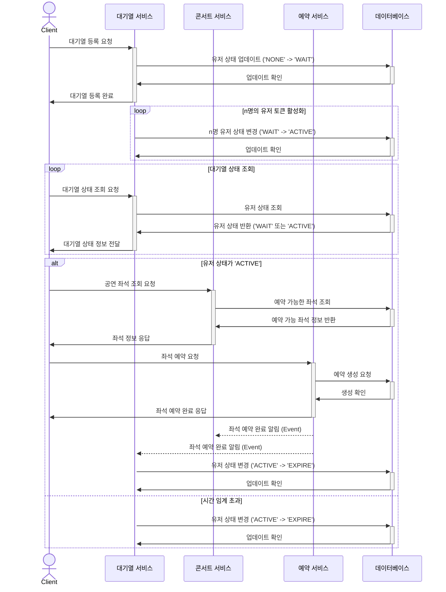
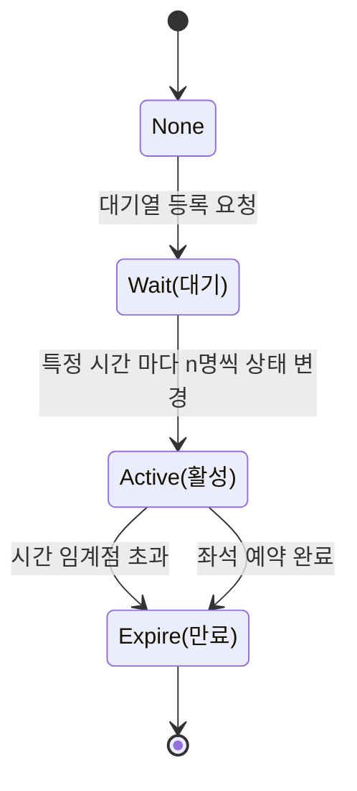
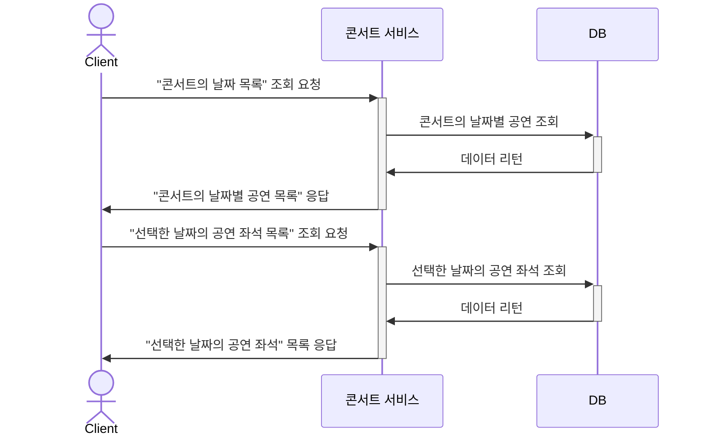
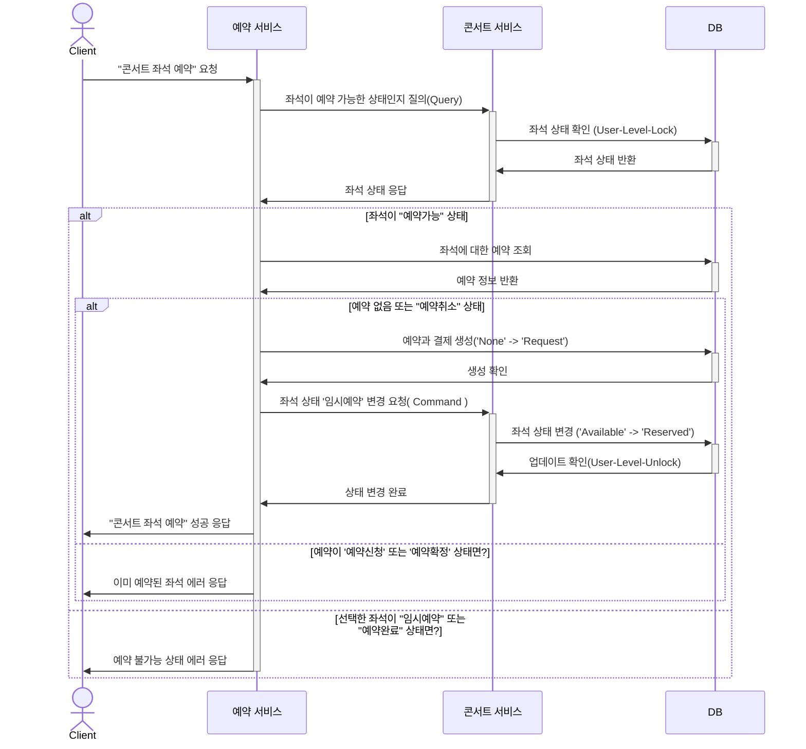
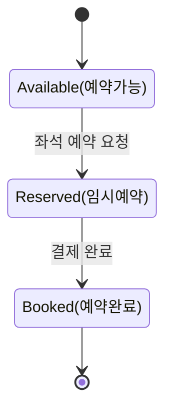
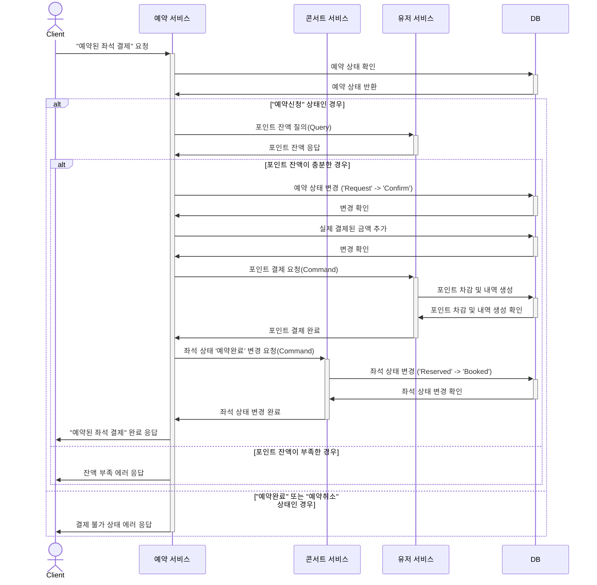
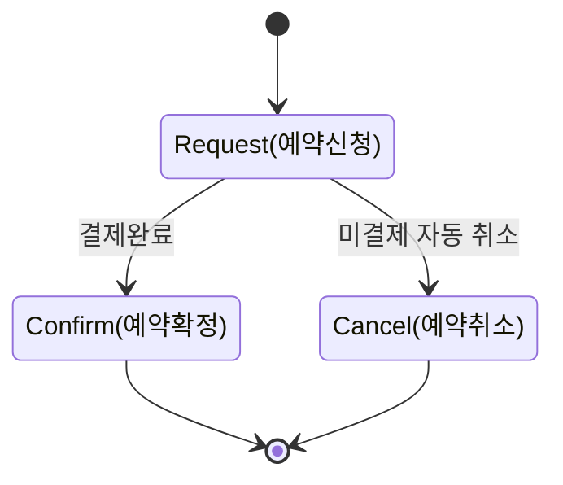
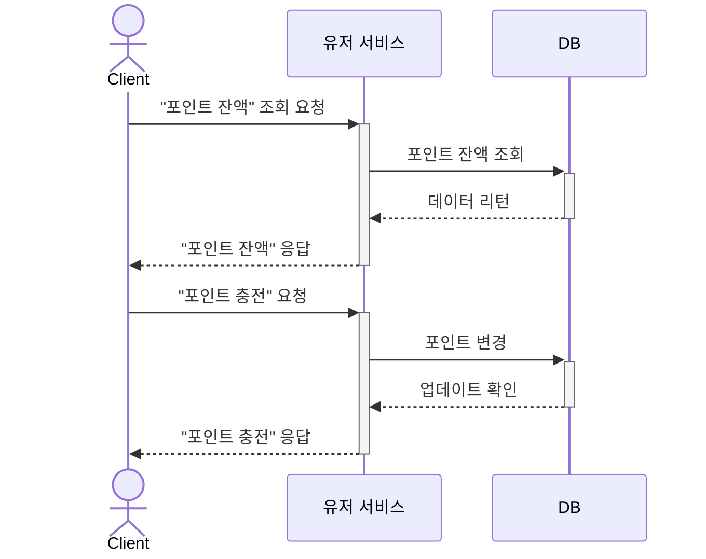

> [!NOTE] 목차
> UseCase 시퀀스 다이어 그램
- [1. 대기열 서비스 시점에서 시퀀스 다이어그램](#1-대기열-서비스-시점에서-시퀀스-다이어그램)
  - [상태 다이어그램](#상태-다이어그램)
  - [대기열 상태 enum](#대기열-상태-enum)
- [2. 예약 가능한 좌석 찾는 시퀀스 다이어그램](#2-예약-가능한-좌석-찾는-시퀀스-다이어그램)
- [3. 좌석을 임시로 예약하는 과정 시퀀스 다이어그램](#3-좌석을-임시로-예약하는-과정-시퀀스-다이어그램)
  - [상태 다이어그램](#상태-다이어그램-1)
  - [좌석 상태 enum](#좌석-상태-enum)
- [4. 예약된 좌석이 최종 예약완료 되는 시퀀스 다이어그램](#4-예약된-좌석이-최종-예약완료-되는-시퀀스-다이어그램)
  - [상태 다이어그램](#상태-다이어그램-2)
  - [예약 상태 enum](#예약-상태-enum)
- [5. 유저 서비스 - 포인트 조회 충전](#5-유저-서비스---포인트-조회-충전)


## 1. 대기열 서비스 시점에서 시퀀스 다이어그램

> [!NOTE] 
> 놀이공원(유량제어) 방식 대기열의 “상태” 변화를 중점으로 표현했습니다.



### 상태 다이어그램
    

    
### 대기열 상태 enum
    
```typescript
/** 대기열 상태 */
enum QueueStatus {
    /** 없음 */
    NONE = 'None',
    /** 대기 */
    WAIT = 'Wait',
    /** 활성 */
    ACTIVE = 'Active',
    /** 만료 */
    EXPIRE = 'Expire'
}
```

## 2. 예약 가능한 좌석 찾는 시퀀스 다이어그램

> [!NOTE] 
> 콘서트 > 공연 > 좌석 순서로 조회하는 과정을 다이어그램으로 표현 했습니다.
> - 콘서트 공연과 좌석 조회는 대기열 토큰이 활성화 상태일때 가능합니다.



## 3. 좌석을 임시로 예약하는 과정 시퀀스 다이어그램

> [!NOTE] 
> 콘서트 공연의 좌석이 ‘임시예약’ 되는 과정을 표현한 시퀀스 다이어그램입니다.



### 상태 다이어그램
    

    
### 좌석 상태 enum
    
```typescript
/** 콘서트 좌석 상태 */
enum SeatStatus {
    /** 예약가능 */
    AVAILABLE = 'Available',
    /** 임시예약 */
    RESERVED = 'Reserved',
    /** 예약완료 */
    BOOKED = 'Booked'
}
```
    

## 4. 예약된 좌석이 최종 예약완료 되는 시퀀스 다이어그램

> [!NOTE] 
> ‘임시예약’ 상태의 좌석이 결제를 통해 최종 ‘예약완료’되는 과정을 표현합니다.



### 상태 다이어그램
    

    
### 예약 상태 enum
    
```typescript
/** 콘서트 좌석 상태 */
enum ReservationStatus {
    /** 예약신청 */
    REQUEST = 'Request',
    /** 예약확정 */
    CONFIRM = 'Confirm',
    /** 예약취소 */
    CANCEL = 'Cancel'
}
```
    

## 5. 유저 서비스 - 포인트 조회 충전

> [!NOTE] 
> 포인트 조회, 포인트 충전 과정을 표현 했습니다.

