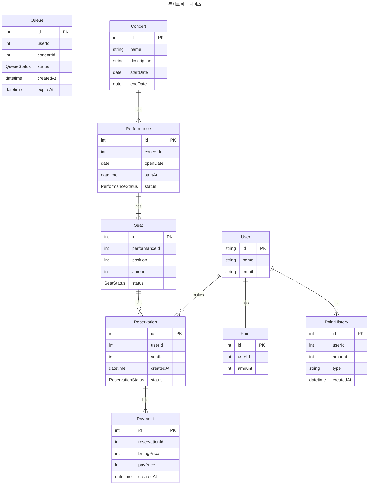

# ERD 설계서

## 1. ERD

## 2. ERD 관계 설명

### 콘서트 서비스

- `Consert`(콘서트)와 `Performance`(공연)는 1 : N 관계를 가집니다.
- `Performance`와 `Seat`는 1 : N 관계를 가집니다.
- `Seat`와 `Resrvation`은 1 : N 관계를 가집니다.
    - 좌석 점유시간 초과나 취소등을 고려해 1 : N으로 설정되어야 한다고 생각했습니다.

### 예약 서비스

- `Resrvation`는 반드시 1개의 `Payment`를 가집니다.
    - 결제 취소 분할 결제 등을 고려해 1 : N으로 설정되어야 한다고 생각했습니다.

### 유저서비스

- User와 Point는 1 : 1 관계를 가집니다.
- User와 PointHistory는 1 : N 관계를 가집니다.

