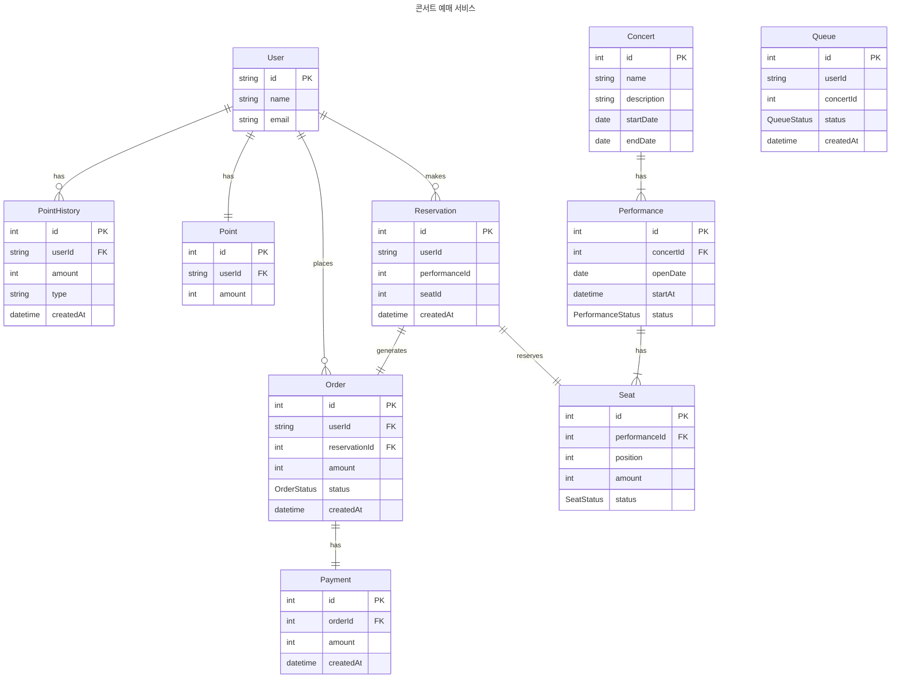

# ERD 설계서

## 1. ERD

## 2. ERD 관계 설명

### 유저서비스

- User와 Point는 1 : 1 관계를 가집니다.
- User와 PointHistory는 1 : N 관계를 가집니다.

### 주문서비스

- `Order`은 반드시 1개의 `Resrvation`을 가집니다.
    - 취소를 고려한다면 1 : N으로 조정되어야 합니다.
- `Order`는 반드시 1개의 `Payment`를 가집니다.
    - 취소를 고려한다면 1 : N으로 조정되어야 합니다.

### 콘서트 서비스

- `Consert`(콘서트)와 `Performance`(공연)는 1 : N 관계를 가집니다.
- `Performance`와 `Seat`는 1 : N 관계를 가집니다.
- `Seat`와 `Resrvation`은 1 : 1 관계를 가집니다.
    - 취소를 고려한다면 1 : N으로 조정되어야 합니다.