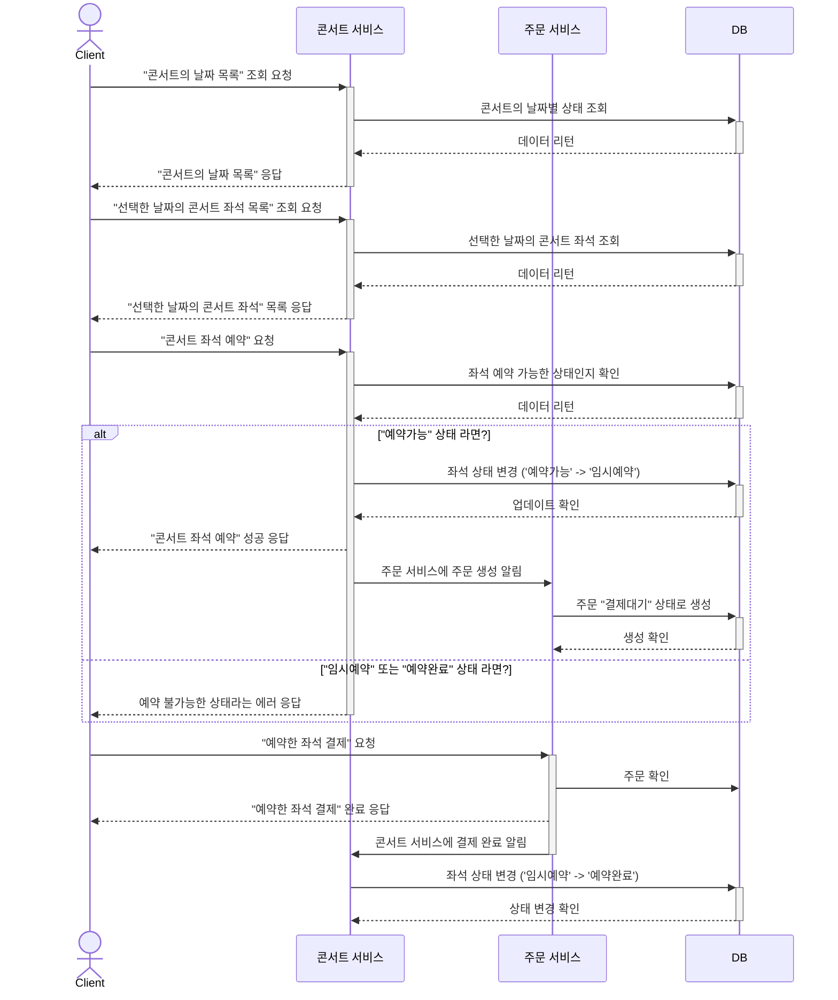

## UseCase 시퀀스 다이어 그램

- [UseCase 시퀀스 다이어 그램](#usecase-시퀀스-다이어-그램)
  - [1. 유저와 대기열 서비스 시퀀스 다이어그램](#1-유저와-대기열-서비스-시퀀스-다이어그램)
  - [2. 콘서트 예약 시퀀스 다이어그램](#2-콘서트-예약-시퀀스-다이어그램)
  - [3. 결제 시퀀스 다이어그램](#3-결제-시퀀스-다이어그램)
  - [4. 유저 서비스 - 포인트 조회 충전](#4-유저-서비스---포인트-조회-충전)

### 1. 유저와 대기열 서비스 시퀀스 다이어그램
> [!NOTE] 
> 놀이공원(유량제어) 방식 대기열의 “상태” 변화를 중점으로 표현했습니다.

### 2. 콘서트 예약 시퀀스 다이어그램
> [!NOTE] 
> 콘서트 좌석이 “임시 예약” 되고 “예약 완료” 되는 일련의 과정을 중점으로 표현했습니다.

### 3. 결제 시퀀스 다이어그램
> [!NOTE] 
> 예약된 공연을 결제 하는 일련의 과정을 중심을 표현했습니다.
> - 결제는 대기열 토큰이 필요하지 않습니다.

### 4. 유저 서비스 - 포인트 조회 충전
> [!NOTE] 
> 포인트 조회, 포인트 충전에 관해 명시 했습니다.

